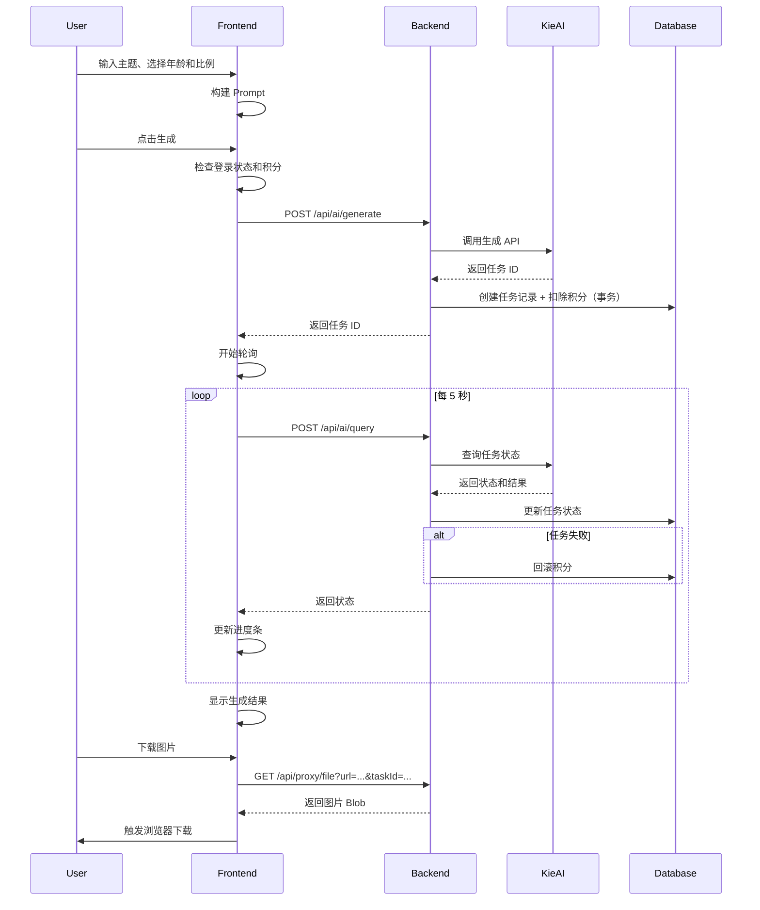
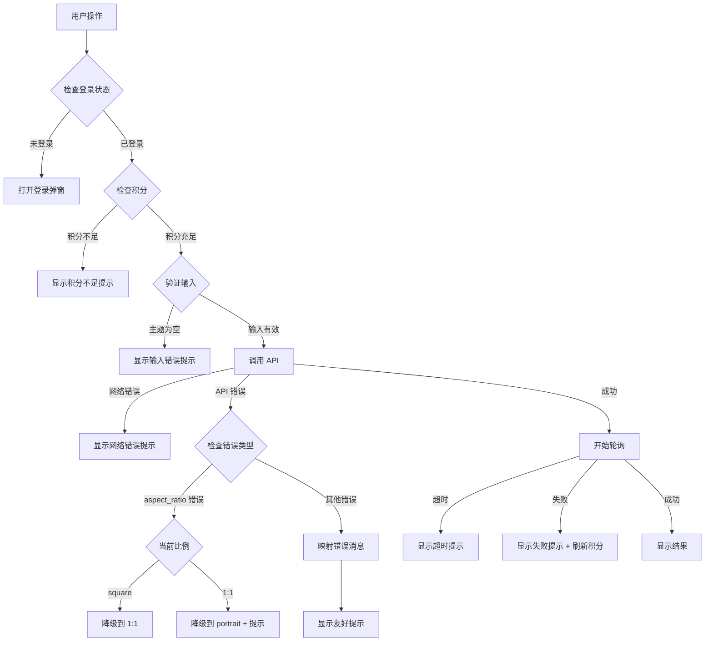

# AI 涂色页生成器 - 设计文档

## 1. 概述

### 1.1 设计目标

本设计文档描述了 AI 涂色页生成器的技术实现方案。该功能为 3-10 岁儿童的家长和教师提供快速生成可打印黑白涂色页的工具。

### 1.2 核心特性

- 基于主题的文本到图像生成
- 年龄适配的线条粗细和复杂度控制
- 多种图片比例支持（竖版、横版、正方形）
- 积分系统集成
- 高分辨率输出（最短边 ≥ 1024px）

### 1.3 技术栈

- **前端框架**: React + TypeScript + Next.js
- **UI 组件**: shadcn/ui (Button, Card, Input, RadioGroup, Progress, etc.)
- **状态管理**: React Hooks (useState, useEffect, useCallback, useMemo)
- **国际化**: next-intl
- **AI 提供商**: kie.ai (nano-banana-pro 模型)
- **图片代理**: 内部代理接口 `/api/proxy/file`

---

## 2. 架构设计

### 2.1 组件架构

```
ColoringPageGenerator (核心组件)
├── 标题栏
│   ├── 标题文本
│   └── Add Image 按钮（可选）
├── 主题输入区
│   ├── Textarea (多行文本框)
│   └── 字符计数器
├── 选项区域
│   ├── 年龄选择器 (Checkbox 样式的 RadioGroup)
│   └── 比例选择器 (Select 下拉菜单)
├── 操作按钮区
│   ├── 清除按钮
│   ├── 随机按钮（可选）
│   └── 生成按钮（主要操作）
├── 积分/试用信息
├── 进度指示器 (Progress)
└── 结果展示区
    ├── 图片展示 (LazyImage)
    └── 下载按钮 (Button)
```

### 2.2 数据流

```
用户输入 → Prompt 构建 → API 调用 → 任务创建 → 轮询状态 → 结果展示
                                    ↓
                                积分扣除
                                    ↓
                            (失败时自动回滚)
```

### 2.3 API 交互流程



**注意**：实际后端流程是先调用 provider API，成功后才在数据库事务中创建任务记录并扣除积分。这样可以避免在 provider 调用失败时还扣除积分。

---

## 3. 组件和接口

### 3.1 ColoringPageGenerator 组件

#### 3.1.1 Props 接口

```typescript
interface ColoringPageGeneratorProps {
  srOnlyTitle?: string;      // 屏幕阅读器标题
  className?: string;         // 自定义样式类
}
```

#### 3.1.2 状态定义

```typescript
// 用户输入状态
const [theme, setTheme] = useState<string>('');
const [ageGroup, setAgeGroup] = useState<'toddler' | 'child'>('toddler');
const [aspectRatio, setAspectRatio] = useState<'portrait' | 'landscape' | 'square'>('portrait');

// 生成状态
const [isGenerating, setIsGenerating] = useState<boolean>(false);
const [progress, setProgress] = useState<number>(0);
const [taskId, setTaskId] = useState<string | null>(null);
const [generationStartTime, setGenerationStartTime] = useState<number | null>(null);
const [taskStatus, setTaskStatus] = useState<AITaskStatus | null>(null);
const [fallbackAttempts, setFallbackAttempts] = useState<number>(0); // 降级尝试次数

// 结果状态
const [generatedImage, setGeneratedImage] = useState<GeneratedImage | null>(null);
const [downloadingImageId, setDownloadingImageId] = useState<string | null>(null);

// 挂载状态
const [isMounted, setIsMounted] = useState<boolean>(false);

// Refs（用于清理）
const successTimeoutRef = useRef<NodeJS.Timeout | null>(null);

// 从 Context 获取
const { user, isCheckSign, setIsShowSignModal, fetchUserCredits } = useAppContext();
```

**生命周期管理**：
- 组件挂载时设置 `isMounted = true`
- 组件卸载时清理：
  - 停止轮询定时器
  - 清理成功后的延迟重置 timeout（`clearTimeout(successTimeoutRef.current)`）
  - 避免在卸载后更新状态

**降级尝试限制**：
- 使用 `fallbackAttempts` 状态跟踪降级次数
- 最多降级 2 次（square → 1:1 → portrait）
- 超过限制则停止降级，走正常失败流程

**清理示例**：
```typescript
useEffect(() => {
  return () => {
    // 组件卸载时清理 timeout
    if (successTimeoutRef.current) {
      clearTimeout(successTimeoutRef.current);
    }
  };
}, []);
```

#### 3.1.3 类型定义

```typescript
interface GeneratedImage {
  id: string;
  url: string;
  provider?: string;
  model?: string;
  prompt?: string;
}

interface BackendTask {
  id: string;
  status: string;
  provider: string;
  model: string;
  prompt: string | null;
  options: string | null;    // JSON 字符串，包含 aspect_ratio 等参数
  taskInfo: string | null;
  taskResult: string | null;
}

enum AITaskStatus {
  PENDING = 'pending',
  PROCESSING = 'processing',
  SUCCESS = 'success',
  FAILED = 'failed',
}
```

### 3.2 核心函数接口

#### 3.2.1 Prompt 构建函数

```typescript
/**
 * 根据用户输入构建完整的 AI prompt
 * @param theme - 用户输入的主题
 * @param ageGroup - 选择的年龄组
 * @returns 完整的 prompt 字符串
 */
function buildColoringPrompt(theme: string, ageGroup: 'toddler' | 'child'): string {
  const ageDescriptions = {
    toddler: 'simple coloring page for toddlers, very thick bold black outlines, minimal details, large simple shapes, lots of white space, pure white background, black and white line art only, no shading, no colors, no background elements, clean lines, with a simple rectangular border frame around the page, suitable for 3-5 year olds',
    child: 'coloring page for children, medium thickness black outlines, moderate details, clear defined areas, pure white background, black and white line art only, no shading, no colors, no background elements, clean lines, with a simple rectangular border frame around the page, suitable for 6-10 year olds',
  };
  
  return `${theme}, ${ageDescriptions[ageGroup]}`;
}
```

#### 3.2.2 生成处理函数

```typescript
/**
 * 处理生成请求
 * 1. 验证用户登录状态和积分
 * 2. 验证输入
 * 3. 调用 API
 * 4. 开始轮询
 */
async function handleGenerate(): Promise<void> {
  // 1. 检查登录状态
  if (!user) {
    setIsShowSignModal(true);
    return;
  }
  
  // 2. 检查积分
  const remainingCredits = user?.credits?.remainingCredits ?? 0;
  if (remainingCredits < 2) {
    toast.error(t('error_insufficient_credits'));
    return;
  }
  
  // 3. 验证输入
  const trimmedTheme = theme.trim();
  if (!trimmedTheme) {
    toast.error(t('error_empty_theme'));
    return;
  }
  
  // 4. 初始化状态
  setIsGenerating(true);
  setProgress(15);
  setTaskStatus(AITaskStatus.PENDING);
  setGeneratedImage(null);
  setGenerationStartTime(Date.now());
  
  try {
    // 5. 构建 prompt
    const prompt = buildColoringPrompt(trimmedTheme, ageGroup);
    
    // 6. 调用 API
    const resp = await fetch('/api/ai/generate', {
      method: 'POST',
      headers: {
        'Content-Type': 'application/json',
      },
      body: JSON.stringify({
        mediaType: 'IMAGE',
        scene: 'text-to-image',
        provider: 'kie',
        model: 'nano-banana-pro',
        prompt,
        options: {
          aspect_ratio: aspectRatio,
          resolution: 'high',
        },
      }),
    });
    
    if (!resp.ok) {
      throw new Error(`request failed with status: ${resp.status}`);
    }
    
    const { code, message, data } = await resp.json();
    if (code !== 0) {
      // 检查是否为 aspect_ratio 错误
      if (aspectRatio === 'square' && isAspectRatioError({ message })) {
        // 降级到 1:1 格式
        return handleGenerateWithFallback('1:1');
      }
      // 直接抛出原始错误消息，由 catch 块统一处理映射
      throw new Error(message || t('error_generation_failed'));
    }
    
    const newTaskId = data?.id;
    if (!newTaskId) {
      throw new Error(t('error_missing_task_id'));
    }
    
    // 7. 设置任务 ID 并开始轮询
    setTaskId(newTaskId);
    setProgress(25);
    
    // 8. 刷新积分
    await fetchUserCredits();
  } catch (error: any) {
    console.error('Failed to generate coloring page:', error);
    // 网络错误优先显示网络提示（不区分大小写）
    const errorMsg = error.message || '';
    if (errorMsg.toLowerCase().includes('fetch') || errorMsg.toLowerCase().includes('network')) {
      toast.error(t('error_network'));
    } else {
      // 统一映射错误消息
      toast.error(mapErrorMessage(errorMsg) || t('error_generation_failed'));
    }
    resetTaskState();
  }
}

/**
 * 使用降级的 aspect_ratio 重新生成
 * 注意：此函数会重新初始化生成状态，确保新任务能正常轮询
 */
async function handleGenerateWithFallback(fallbackRatio: string): Promise<void> {
  const trimmedTheme = theme.trim();
  const prompt = buildColoringPrompt(trimmedTheme, ageGroup);
  
  // 重新初始化生成状态（确保轮询能继续）
  setIsGenerating(true);
  setProgress(15);
  setTaskStatus(AITaskStatus.PENDING);
  setGeneratedImage(null);
  setGenerationStartTime(Date.now());
  
  try {
    const resp = await fetch('/api/ai/generate', {
      method: 'POST',
      headers: {
        'Content-Type': 'application/json',
      },
      body: JSON.stringify({
        mediaType: 'IMAGE',
        scene: 'text-to-image',
        provider: 'kie',
        model: 'nano-banana-pro',
        prompt,
        options: {
          aspect_ratio: fallbackRatio,
          resolution: 'high',
        },
      }),
    });
    
    if (!resp.ok) {
      throw new Error(`request failed with status: ${resp.status}`);
    }
    
    const { code, message, data } = await resp.json();
    if (code !== 0) {
      // 如果 1:1 也失败，最终降级到 portrait
      if (fallbackRatio === '1:1' && isAspectRatioError({ message })) {
        return handleGenerateWithFallback('portrait');
      }
      // 直接抛出原始错误消息，由 catch 块统一处理映射
      throw new Error(message || t('error_generation_failed'));
    }
    
    const newTaskId = data?.id;
    if (!newTaskId) {
      throw new Error(t('error_missing_task_id'));
    }
    
    // 如果降级到 portrait，显示提示
    if (fallbackRatio === 'portrait') {
      toast.info(t('error_aspect_ratio_fallback'));
    }
    
    // 设置新任务 ID 并开始轮询
    setTaskId(newTaskId);
    setProgress(25);
    await fetchUserCredits();
  } catch (error: any) {
    console.error('Failed to generate with fallback:', error);
    // 网络错误优先显示网络提示（不区分大小写）
    const errorMsg = error.message || '';
    if (errorMsg.toLowerCase().includes('fetch') || errorMsg.toLowerCase().includes('network')) {
      toast.error(t('error_network'));
    } else {
      // 统一映射错误消息
      toast.error(mapErrorMessage(errorMsg) || t('error_generation_failed'));
    }
    resetTaskState();
  }
}
```

#### 3.2.3 任务轮询函数

```typescript
/**
 * 轮询任务状态
 * @param id - 任务 ID
 * @returns 是否完成（成功或失败）
 */
async function pollTaskStatus(id: string): Promise<boolean> {
  try {
    // 1. 检查超时
    if (
      generationStartTime &&
      Date.now() - generationStartTime > 180000 // 3 分钟
    ) {
      resetTaskState();
      toast.error(t('error_timeout'));
      return true;
    }
    
    // 2. 查询任务状态
    const resp = await fetch('/api/ai/query', {
      method: 'POST',
      headers: {
        'Content-Type': 'application/json',
      },
      body: JSON.stringify({ taskId: id }),
    });
    
    if (!resp.ok) {
      throw new Error(`request failed with status: ${resp.status}`);
    }
    
    const { code, message, data } = await resp.json();
    if (code !== 0) {
      throw new Error(message || 'Query task failed');
    }
    
    const task = data as BackendTask;
    const currentStatus = task.status as AITaskStatus;
    setTaskStatus(currentStatus);
    
    // 3. 解析任务结果
    const parsedResult = parseTaskResult(task.taskInfo);
    const imageUrls = extractImageUrls(parsedResult);
    
    // 4. 根据状态更新进度
    if (currentStatus === AITaskStatus.PENDING) {
      setProgress((prev) => Math.max(prev, 25));
      return false;
    }
    
    if (currentStatus === AITaskStatus.PROCESSING) {
      if (imageUrls.length > 0) {
        // 已有预览图
        setGeneratedImage({
          id: task.id,
          url: imageUrls[0],
          provider: task.provider,
          model: task.model,
          prompt: task.prompt ?? undefined,
        });
        setProgress((prev) => Math.max(prev, 85));
      } else {
        setProgress((prev) => Math.min(prev + 10, 80));
      }
      return false;
    }
    
    if (currentStatus === AITaskStatus.SUCCESS) {
      if (imageUrls.length === 0) {
        toast.error(t('error_no_images'));
      } else {
        setGeneratedImage({
          id: task.id,
          url: imageUrls[0],
          provider: task.provider,
          model: task.model,
          prompt: task.prompt ?? undefined,
        });
        toast.success(t('success_generated'));
      }
      
      setProgress(100);
      
      // 延迟 1 秒后重置状态，让用户看到完成状态
      // 清理之前的 timeout（如果存在）
      if (successTimeoutRef.current) {
        clearTimeout(successTimeoutRef.current);
      }
      successTimeoutRef.current = setTimeout(() => {
        resetTaskState();
        successTimeoutRef.current = null;
      }, 1000);
      
      return true;
    }
    
    if (currentStatus === AITaskStatus.FAILED) {
      // 检查是否为 aspect_ratio 错误（异步失败）
      // 从任务 options 中解析当前尝试的比例
      const taskInfo = safeParseJSON(task.taskInfo);
      if (isAspectRatioError(taskInfo || { message: task.taskInfo })) {
        // 检查降级次数限制（最多 2 次）
        if (fallbackAttempts >= 2) {
          // 超过限制，停止降级，走正常失败流程
          toast.error(t('error_aspect_ratio_not_supported'));
          resetTaskState();
          fetchUserCredits();
          return true;
        }
        
        // 解析任务的 options 以确定当前比例
        const taskOptions = safeParseJSON(task.options);
        const currentRatio = taskOptions?.aspect_ratio;
        
        // 如果无法解析当前比例，停止降级（防止无限循环）
        if (!currentRatio) {
          toast.error(t('error_generation_failed'));
          resetTaskState(); // 重置所有状态包括降级次数
          fetchUserCredits();
          return true;
        }
        
        // 根据当前比例决定降级路径
        if (currentRatio === 'square') {
          // square 失败 -> 降级到 1:1
          setFallbackAttempts(prev => prev + 1);
          resetTaskState(false); // 不重置降级次数
          handleGenerateWithFallback('1:1');
          return true;
        } else if (currentRatio === '1:1') {
          // 1:1 失败 -> 降级到 portrait
          setFallbackAttempts(prev => prev + 1);
          resetTaskState(false); // 不重置降级次数
          handleGenerateWithFallback('portrait');
          return true;
        }
        // portrait 失败则不再降级，走正常失败流程
      }
      
      const errorMessage = parsedResult?.errorMessage || t('error_generation_failed');
      toast.error(mapErrorMessage(errorMessage));
      resetTaskState();
      
      // 刷新积分（后端已自动回滚）
      fetchUserCredits();
      
      return true;
    }
    
    setProgress((prev) => Math.min(prev + 5, 95));
    return false;
  } catch (error: any) {
    console.error('Error polling task:', error);
    toast.error(t('error_network'));
    resetTaskState();
    
    fetchUserCredits();
    
    return true;
  }
}
```

#### 3.2.4 下载图片函数

```typescript
/**
 * 下载生成的涂色页
 * @param image - 生成的图片对象
 */
async function handleDownloadImage(image: GeneratedImage): Promise<void> {
  if (!image.url) {
    return;
  }
  
  try {
    setDownloadingImageId(image.id);
    
    // 1. 通过代理获取图片（传递 taskId 用于权限验证）
    // 注意：URL 必须使用 encodeURIComponent 编码
    const resp = await fetch(
      `/api/proxy/file?url=${encodeURIComponent(image.url)}&taskId=${encodeURIComponent(image.id)}`
    );
    if (!resp.ok) {
      throw new Error(t('error_fetch_image_failed'));
    }
    
    // 2. 转换为 Blob
    const blob = await resp.blob();
    const blobUrl = URL.createObjectURL(blob);
    
    // 3. 创建下载链接
    const link = document.createElement('a');
    link.href = blobUrl;
    
    // 4. 生成文件名
    const themePrefix = theme.slice(0, 10).replace(/[^a-zA-Z0-9\u4e00-\u9fa5]/g, '-');
    const timestamp = Date.now();
    link.download = `coloring-page-${themePrefix}-${timestamp}.jpg`;
    
    // 5. 触发下载
    document.body.appendChild(link);
    link.click();
    document.body.removeChild(link);
    
    // 6. 清理
    setTimeout(() => URL.revokeObjectURL(blobUrl), 200);
    
    toast.success(t('success_downloaded'));
  } catch (error) {
    console.error('Failed to download image:', error);
    toast.error(t('error_download_failed'));
  } finally {
    setDownloadingImageId(null);
  }
}
```

#### 3.2.5 辅助函数

```typescript
/**
 * 重置任务状态
 * @param resetFallbackAttempts - 是否重置降级尝试次数（默认 true）
 */
function resetTaskState(resetFallbackAttempts: boolean = true): void {
  setIsGenerating(false);
  setProgress(0);
  setTaskId(null);
  setGenerationStartTime(null);
  setTaskStatus(null);
  
  // 只在非降级场景下重置降级尝试次数
  if (resetFallbackAttempts) {
    setFallbackAttempts(0);
  }
}

/**
 * 解析任务结果 JSON
 */
function parseTaskResult(taskResult: string | null): any {
  if (!taskResult) {
    return null;
  }
  
  try {
    return JSON.parse(taskResult);
  } catch (error) {
    console.warn('Failed to parse taskResult:', error);
    return null;
  }
}

/**
 * 安全解析 JSON（用于 taskInfo 和 task.options）
 */
function safeParseJSON(jsonString: string | null): any {
  if (!jsonString) {
    return null;
  }
  
  // 如果已经是对象，直接返回
  if (typeof jsonString === 'object') {
    return jsonString;
  }
  
  try {
    return JSON.parse(jsonString);
  } catch (error) {
    return null;
  }
}

/**
 * 从结果中提取图片 URL
 */
function extractImageUrls(result: any): string[] {
  if (!result) {
    return [];
  }
  
  const output = result.output ?? result.images ?? result.data;
  
  if (!output) {
    return [];
  }
  
  if (typeof output === 'string') {
    return [output];
  }
  
  if (Array.isArray(output)) {
    return output
      .flatMap((item) => {
        if (!item) return [];
        if (typeof item === 'string') return [item];
        if (typeof item === 'object') {
          const candidate =
            item.url ?? item.uri ?? item.image ?? item.src ?? item.imageUrl;
          return typeof candidate === 'string' ? [candidate] : [];
        }
        return [];
      })
      .filter(Boolean);
  }
  
  if (typeof output === 'object') {
    const candidate =
      output.url ?? output.uri ?? output.image ?? output.src ?? output.imageUrl;
    if (typeof candidate === 'string') {
      return [candidate];
    }
  }
  
  return [];
}

/**
 * 映射错误消息为用户友好提示
 * 规范化策略：trim + toLowerCase + 去除尾部标点 (.!?)
 * 精确匹配：prompt is required/prompt required/missing prompt/empty prompt → "请输入涂色页主题"
 * 其他错误 → "生成失败，请重试"
 */
function mapErrorMessage(error: string): string {
  if (!error) {
    return t('error_generation_failed');
  }
  
  // 规范化：去首尾空格、转小写、去除尾部标点
  const normalized = error.trim().toLowerCase().replace(/[.!?]+$/, '');
  
  // 精确匹配 prompt 缺失错误
  const promptMissingPatterns = [
    'prompt is required',
    'prompt required',
    'missing prompt',
    'empty prompt',
  ];
  
  if (promptMissingPatterns.includes(normalized)) {
    return t('error_empty_theme');
  }
  
  // 其他错误返回通用提示
  return t('error_generation_failed');
}

/**
 * 判断是否为 aspect_ratio 相关错误
 * 优先检查结构化错误字段，兜底使用文本匹配
 * 文本匹配：规范化后做子串匹配，包含关键词不区分大小写
 */
function isAspectRatioError(error: any): boolean {
  if (!error) {
    return false;
  }
  
  // 优先检查结构化错误字段
  if (error.errorCode && typeof error.errorCode === 'string') {
    const code = error.errorCode.toLowerCase();
    if (code.includes('aspect') || code.includes('ratio')) {
      return true;
    }
  }
  
  if (error.error?.type && typeof error.error.type === 'string') {
    const type = error.error.type.toLowerCase();
    if (type.includes('aspect') || type.includes('ratio')) {
      return true;
    }
  }
  
  // 兜底：文本匹配
  const message = error.message || error.errorMessage || String(error);
  if (!message) {
    return false;
  }
  
  const normalized = message.toLowerCase();
  const keywords = ['aspect_ratio', 'aspect ratio', 'invalid ratio', 'unsupported ratio'];
  
  return keywords.some(keyword => normalized.includes(keyword));
}
```

### 3.3 API 接口

#### 3.3.1 生成接口

**端点**: `POST /api/ai/generate`

**请求体**:
```typescript
{
  mediaType: 'IMAGE',
  scene: 'text-to-image',
  provider: 'kie',
  model: 'nano-banana-pro',
  prompt: string,  // 构建的完整 prompt
  options: {
    aspect_ratio: 'portrait' | 'landscape' | 'square' | '1:1',
    resolution: 'high'
  }
}
```

**响应**:
```typescript
{
  code: 0,
  message: 'ok',
  data: {
    id: string,           // 任务 ID
    status: string,       // 任务状态
    provider: string,     // 提供商
    model: string,        // 模型
    prompt: string,       // Prompt
    taskInfo: string | null,
    taskResult: string | null,
    costCredits: number   // 消耗积分
  }
}
```

#### 3.3.2 查询接口

**端点**: `POST /api/ai/query`

**请求体**:
```typescript
{
  taskId: string
}
```

**响应**:
```typescript
{
  code: 0,
  message: 'ok',
  data: {
    id: string,
    status: 'pending' | 'processing' | 'success' | 'failed',
    provider: string,
    model: string,
    prompt: string | null,
    options: string | null,   // JSON 字符串，包含 aspect_ratio 等参数
    taskInfo: string | null,  // JSON 字符串，包含错误信息或结果
    taskResult: string | null
  }
}
```

#### 3.3.3 代理接口

**端点**: `GET /api/proxy/file?url={imageUrl}&taskId={taskId}`

**查询参数**:
- `url`: 图片 URL（必须，应使用 `encodeURIComponent` 编码）
- `taskId`: 任务 ID（必须，用于权限验证，指 `ai_task.id` 内部任务 ID，非 `ai_task.task_id` provider 任务 ID）

**认证方式**:
- 基于会话（Session/Cookie）认证，与系统其他接口保持一致
- 用户必须已登录，通过会话验证身份

**成功响应**: 
- 状态码：200 OK
- 内容类型：image/jpeg 或其他图片 MIME 类型
- 响应体：图片 Blob

**错误响应**:

| 状态码 | 触发条件 | 说明 |
|--------|---------|------|
| 401 Unauthorized | 用户未登录 | 会话无效或不存在 |
| 403 Forbidden | 任务不存在 | taskId 对应的任务不存在 |
| 403 Forbidden | 任务不属于当前用户 | 尝试访问其他用户的任务 |
| 403 Forbidden | URL 不在白名单 | URL 域名不在可信白名单内 |
| 403 Forbidden | URL 不属于该任务 | URL 不在任务的生成结果列表中 |
| 403 Forbidden | taskInfo 解析失败 | 无法验证 URL 归属 |
| 429 Too Many Requests | 请求频率过高 | 触发限流 |
| 500 Internal Server Error | 服务器错误 | 代理请求失败或其他内部错误 |

**权限验证**（按顺序执行）:
1. 验证用户已登录（会话有效）
2. 验证 taskId 对应的任务存在
3. 验证任务属于当前登录用户
4. 验证 URL 在白名单内（kie.ai 等可信域名）
5. **验证 URL 属于该任务的生成结果**（从 taskInfo 或 taskResult 中提取图片 URL 列表，确认请求的 URL 在列表中）
6. 验证请求频率（限流）

**URL 匹配规则**:
- 主机名不区分大小写（kie.ai 等同于 KIE.AI）
- 协议必须匹配（https vs http）
- 路径和查询参数必须完全匹配（区分大小写）
- **尾斜杠处理**：严格匹配，不做规范化（/path 和 /path/ 视为不同 URL，除非 provider 明确返回两者）

**注意**：
- `taskId` 参数指的是数据库表 `ai_task` 的主键 `id`（UUID），不是 `task_id` 字段（provider 返回的任务 ID）
- URL 参数必须使用 `encodeURIComponent` 编码，特别是当 URL 包含查询参数时
- 认证方式为会话认证，测试时需要模拟登录会话，不使用 Bearer token

---

## 4. 数据模型

### 4.1 数据库模型

复用现有的 `ai_task` 表，无需创建新表。

**ai_task 表结构**:
```sql
CREATE TABLE ai_task (
  id UUID PRIMARY KEY,
  user_id UUID NOT NULL,
  media_type VARCHAR(50) NOT NULL,  -- 'IMAGE'
  scene VARCHAR(50) NOT NULL,       -- 'text-to-image'
  provider VARCHAR(50) NOT NULL,    -- 'kie'
  model VARCHAR(100) NOT NULL,      -- 'nano-banana-pro'
  prompt TEXT,                      -- 完整 prompt
  options JSONB,                    -- { aspect_ratio, resolution }
  status VARCHAR(50) NOT NULL,      -- 任务状态
  cost_credits INTEGER NOT NULL,    -- 消耗积分 (2)
  task_id VARCHAR(255),             -- AI 任务 ID
  task_info TEXT,                   -- 任务信息 (JSON 字符串)
  task_result TEXT,                 -- 任务结果 (JSON 字符串)
  credit_id UUID,                   -- 积分消费记录 ID
  created_at TIMESTAMP DEFAULT NOW(),
  updated_at TIMESTAMP DEFAULT NOW()
);
```

**查询涂色页历史**:
```sql
SELECT * FROM ai_task
WHERE user_id = ?
  AND media_type = 'IMAGE'
  AND scene = 'text-to-image'
  AND provider = 'kie'
  AND options->>'aspect_ratio' IN ('portrait', 'landscape', 'square', '1:1')
ORDER BY created_at DESC;
```

### 4.2 前端数据模型

```typescript
// 生成的图片
interface GeneratedImage {
  id: string;
  url: string;
  provider?: string;
  model?: string;
  prompt?: string;
}

// 后端任务
interface BackendTask {
  id: string;
  status: string;
  provider: string;
  model: string;
  prompt: string | null;
  options: string | null;    // JSON 字符串，包含 aspect_ratio 等参数
  taskInfo: string | null;
  taskResult: string | null;
}

// 任务状态枚举
enum AITaskStatus {
  PENDING = 'pending',
  PROCESSING = 'processing',
  SUCCESS = 'success',
  FAILED = 'failed',
}

// 年龄组类型
type AgeGroup = 'toddler' | 'child';

// 比例类型
type AspectRatio = 'portrait' | 'landscape' | 'square';
```

---

## 5. 正确性属性

### 5.1 什么是正确性属性？

正确性属性（Correctness Properties）是对系统行为的形式化描述，用于验证系统在所有有效输入下都能正确运行。每个属性都是一个普遍量化的陈述（"对于所有..."），可以通过基于属性的测试（Property-Based Testing）来验证。

正确性属性是需求和实现之间的桥梁，它们将人类可读的需求转换为机器可验证的规范。


### 5.2 属性反思

在编写正确性属性之前，我需要审查预分析中识别的可测试属性，消除冗余：

**识别的属性**：
1. Prompt 构建 - 对于任何主题和年龄组，输出应包含主题和对应描述
2. 进度条单调性 - 对于任何状态转换，进度值应单调递增
3. 状态文本映射 - 对于任何任务状态，应返回对应提示文本
4. 文件名生成 - 对于任何主题，文件名应符合格式
5. 错误消息映射 - 对于特定错误模式，应映射为用户友好提示

**冗余分析**：
- 属性 3（状态文本映射）和属性 5（错误消息映射）都是映射逻辑，但它们映射不同的输入（任务状态 vs 错误消息），提供独特的验证价值，保留两者
- 其他属性各自验证不同的功能点，无冗余

**最终属性列表**：
1. Prompt 构建正确性
2. 进度条单调性
3. 状态文本映射正确性
4. 文件名格式正确性
5. 错误消息映射正确性


### 5.3 正确性属性定义

基于预分析和属性反思，以下是可测试的正确性属性：

**属性 1: Prompt 构建包含所有必要元素**

*对于任何*有效的主题字符串和年龄组（toddler 或 child），构建的 prompt 应该同时包含用户输入的主题和对应年龄组的样式描述。

**验证需求**: 2.2.1 Prompt 构建规则

**测试策略**：
- 生成随机主题字符串（1-30 字符）
- 遍历所有年龄组选项
- 验证输出包含主题文本
- 验证输出包含对应的年龄描述关键词（如 "toddler" 或 "children"）

---

**属性 2: 进度值单调递增**

*对于任何*有效的状态转换序列，进度条的值应该单调递增，永不回退。

**验证需求**: 2.4.1 进度条更新规则

**测试策略**：
- 模拟状态转换序列：pending → processing → success
- 在每次状态更新后记录进度值
- 验证后续进度值 ≥ 前一个进度值

---

**属性 3: 任务状态映射到正确的提示文本**

*对于任何*有效的任务状态（pending、processing、success、failed），系统应该返回对应的本地化提示文本。

**验证需求**: 2.4.2 状态提示文本

**测试策略**：
- 遍历所有 AITaskStatus 枚举值
- 验证每个状态都有对应的非空提示文本
- 验证提示文本符合预期格式

---

**属性 4: 下载文件名格式正确**

*对于任何*有效的主题字符串，生成的下载文件名应该符合格式 `coloring-page-{主题前缀}-{时间戳}.jpg`，其中主题前缀是主题的前 10 个字符（非字母数字字符替换为 `-`）。

**验证需求**: 2.5.2 下载功能

**测试策略**：
- 生成随机主题字符串（包含特殊字符、空格、中文等）
- 调用文件名生成逻辑
- 验证文件名以 `coloring-page-` 开头
- 验证文件名以 `.jpg` 结尾
- 验证主题前缀不包含特殊字符
- 验证包含时间戳

---

**属性 5: 错误消息正确映射**

*对于任何*错误消息字符串，`mapErrorMessage` 函数应该返回用户友好的提示。特别地，对于规范化后精确匹配 "prompt is required"、"prompt required"、"missing prompt" 或 "empty prompt" 的错误，应该映射为 "请输入涂色页主题"；其他错误应该映射为 "生成失败，请重试"。

**验证需求**: 2.6.1 输入验证错误, 2.6.3 API 错误

**测试策略**：
- 测试标准格式：`"prompt is required"`、`"Prompt is required"`、`"PROMPT IS REQUIRED"`
- 测试变体格式：`"prompt required"`、`"missing prompt"`、`"empty prompt"`
- 测试带标点：`"prompt is required."`、`"prompt is required!"`
- 测试带空格：`"  prompt is required  "`
- 测试误判场景：`"prompt content is invalid"`、`"prompt 违规"`、`"unsafe prompt"` 应映射为通用提示
- 验证所有 prompt 缺失模式映射为 "请输入涂色页主题"
- 验证其他错误映射为 "生成失败，请重试"

---

**属性 6: aspect_ratio 错误正确识别**

*对于任何*包含 aspect_ratio 相关错误信息的对象，`isAspectRatioError` 函数应该返回 true。函数应该优先检查结构化错误字段（errorCode、error.type），兜底使用文本匹配（包含 "aspect_ratio"、"aspect ratio"、"invalid ratio"、"unsupported ratio" 等关键词）。

**验证需求**: 2.2.2 AI API 调用（降级策略）

**测试策略**：
- 测试结构化错误：`{ errorCode: "INVALID_ASPECT_RATIO" }`、`{ error: { type: "aspect_ratio_error" } }`
- 测试文本匹配：`{ message: "aspect_ratio not supported" }`、`{ message: "Invalid aspect ratio" }`
- 测试 taskInfo 解析：`{ taskInfo: '{"errorCode": "aspect_ratio_error"}' }`（需先 JSON.parse）
- 测试防御性：`{ taskInfo: null }`、`{ taskInfo: "invalid json" }` 应返回 false
- 测试误判：`{ message: "other error" }` 应返回 false


---

## 6. 错误处理

### 6.1 错误分类

#### 6.1.1 输入验证错误

| 错误类型 | 触发条件 | 处理方式 | 用户提示 |
|---------|---------|---------|---------|
| 主题为空 | 用户点击生成但主题为空 | 显示 Toast 错误提示 | "请输入涂色页主题" |
| 主题过长 | 用户输入超过 30 字符 | Input 组件 maxLength 限制 | "主题不能超过 30 个字符" |

#### 6.1.2 权限错误

| 错误类型 | 触发条件 | 处理方式 | 用户提示 |
|---------|---------|---------|---------|
| 未登录 | 用户未登录点击生成 | 打开登录弹窗 | 无（直接打开弹窗） |
| 积分不足 | 已登录用户积分 < 2 | 显示 Toast 错误提示 | "积分不足，请充值后继续" |

#### 6.1.3 API 错误

| 错误类型 | 触发条件 | 处理方式 | 用户提示 |
|---------|---------|---------|---------|
| 网络错误 | 请求失败（网络问题） | 显示 Toast 错误提示 | "网络错误，请检查网络连接" |
| API 返回错误 | API 返回 code !== 0 | 通过 mapErrorMessage 映射后显示 | 映射后的友好提示 |
| 任务超时 | 生成时间超过 3 分钟 | 停止轮询，显示 Toast 错误提示 | "生成超时，请重试" |
| 生成失败 | 任务状态变为 failed | 显示 Toast 错误提示，刷新积分 | 映射后的友好提示 |
| aspect_ratio 不支持 | square 或 1:1 不被支持 | 降级到 portrait，显示 Toast 提示 | "正方形比例暂不支持，已使用竖版比例生成" |

### 6.2 错误处理流程



### 6.3 错误恢复策略

#### 6.3.1 积分回滚

- **触发条件**: 任务状态变为 `failed`
- **执行者**: 后端 `updateAITaskById` 函数
- **时机**: 前端轮询 `/api/ai/query` 时，后端查询 kie.ai 状态并更新任务
- **前端处理**: 轮询检测到 failed 状态后，调用 `fetchUserCredits()` 刷新积分显示

#### 6.3.2 aspect_ratio 降级

- **触发条件**: 检测到 aspect_ratio 相关错误
- **降级路径**: square → 1:1 → portrait
- **检测时机**:
  1. 同步失败：`/api/ai/generate` 立即返回错误
  2. 异步失败：`/api/ai/query` 轮询时从 `taskInfo` 提取错误
- **用户提示**: 最终降级到 portrait 时显示 Toast："正方形比例暂不支持，已使用竖版比例生成"

#### 6.3.3 超时处理

- **超时时间**: 180 秒（3 分钟）
- **处理方式**: 停止轮询，重置状态，显示超时提示
- **积分处理**: 不回滚（任务可能仍在处理中）

---

## 7. 测试策略

### 7.1 测试方法

本项目采用**双重测试方法**：

1. **单元测试（Unit Tests）**：验证特定示例、边缘情况和错误条件
2. **基于属性的测试（Property-Based Tests）**：验证通用属性在所有输入下的正确性

两种测试方法是互补的，共同提供全面的测试覆盖：
- 单元测试捕获具体的 bug 和边缘情况
- 属性测试验证通用正确性并发现意外的边缘情况

### 7.2 单元测试

#### 7.2.1 测试范围

单元测试应专注于：
- 特定示例（如特定主题的 prompt 构建）
- 边缘情况（如空字符串、特殊字符、极长输入）
- 错误条件（如网络错误、API 错误）
- 组件集成点（如按钮状态、UI 交互）

#### 7.2.2 测试框架

- **测试框架**: Jest + React Testing Library
- **覆盖目标**: 核心函数和组件逻辑

#### 7.2.3 关键测试用例

```typescript
describe('buildColoringPrompt', () => {
  it('should build prompt for toddler with simple theme', () => {
    const result = buildColoringPrompt('可爱小恐龙', 'toddler');
    expect(result).toContain('可爱小恐龙');
    expect(result).toContain('toddler');
  });
  
  it('should build prompt for child with complex theme', () => {
    const result = buildColoringPrompt('小猫在花园里玩耍', 'child');
    expect(result).toContain('小猫在花园里玩耍');
    expect(result).toContain('children');
  });
});

describe('mapErrorMessage', () => {
  it('should map "prompt is required" to user-friendly message', () => {
    expect(mapErrorMessage('prompt is required')).toBe('请输入涂色页主题');
  });
  
  it('should map other errors to generic message', () => {
    expect(mapErrorMessage('network error')).toBe('生成失败，请重试');
  });
});

describe('ColoringPageGenerator', () => {
  it('should disable button when theme is empty', () => {
    // Test implementation
  });
  
  it('should show login modal when not logged in', () => {
    // Test implementation
  });
  
  it('should show insufficient credits error', () => {
    // Test implementation
  });
});
```

### 7.3 基于属性的测试

#### 7.3.1 测试框架

- **测试库**: fast-check (JavaScript/TypeScript 的属性测试库)
- **配置**: 每个属性测试至少运行 100 次迭代
- **标签格式**: `Feature: ai-coloring-page-generator, Property {number}: {property_text}`

#### 7.3.2 属性测试实现

每个正确性属性必须由一个属性测试实现：

```typescript
import fc from 'fast-check';

describe('Property-Based Tests', () => {
  // Feature: ai-coloring-page-generator, Property 1: Prompt 构建包含所有必要元素
  it('should build prompt containing theme and age description for any valid input', () => {
    fc.assert(
      fc.property(
        fc.string({ minLength: 1, maxLength: 30 }), // 随机主题
        fc.constantFrom('toddler', 'child'),        // 随机年龄组
        (theme, ageGroup) => {
          const prompt = buildColoringPrompt(theme, ageGroup);
          
          // 验证包含主题
          expect(prompt).toContain(theme);
          
          // 验证包含年龄描述
          if (ageGroup === 'toddler') {
            expect(prompt).toContain('toddler');
          } else {
            expect(prompt).toContain('children');
          }
        }
      ),
      { numRuns: 100 }
    );
  });
  
  // Feature: ai-coloring-page-generator, Property 2: 进度值单调递增
  it('should never decrease progress value during state transitions', () => {
    fc.assert(
      fc.property(
        fc.array(fc.constantFrom('pending', 'processing', 'success'), { minLength: 2, maxLength: 10 }),
        (statusSequence) => {
          let prevProgress = 0;
          
          for (const status of statusSequence) {
            const currentProgress = getProgressForStatus(status, prevProgress);
            expect(currentProgress).toBeGreaterThanOrEqual(prevProgress);
            prevProgress = currentProgress;
          }
        }
      ),
      { numRuns: 100 }
    );
  });
  
  // Feature: ai-coloring-page-generator, Property 5: 错误消息正确映射
  it('should map prompt missing errors to user-friendly message', () => {
    fc.assert(
      fc.property(
        fc.constantFrom(
          'prompt is required',
          'Prompt is required',
          'PROMPT IS REQUIRED',
          'prompt required',
          'Prompt Required',
          'missing prompt',
          'Missing Prompt',
          'empty prompt',
          'Empty Prompt',
          'prompt is required.',
          'prompt is required!',
          '  prompt is required  '
        ),
        (errorMsg) => {
          const result = mapErrorMessage(errorMsg);
          expect(result).toBe('请输入涂色页主题');
        }
      ),
      { numRuns: 100 }
    );
  });
  
  // 误判测试
  it('should not misidentify content errors as missing prompt', () => {
    fc.assert(
      fc.property(
        fc.constantFrom(
          'prompt content is invalid',
          'prompt 违规',
          'unsafe prompt',
          'inappropriate prompt'
        ),
        (errorMsg) => {
          const result = mapErrorMessage(errorMsg);
          expect(result).toBe('生成失败，请重试');
        }
      ),
      { numRuns: 100 }
    );
  });
});
```

### 7.4 集成测试

#### 7.4.1 E2E 测试

使用 Playwright 或 Cypress 进行端到端测试：

```typescript
describe('Coloring Page Generator E2E', () => {
  it('should generate coloring page for logged-in user', async () => {
    // 1. 登录
    await login();
    
    // 2. 输入主题
    await page.fill('[data-testid="theme-input"]', '可爱小恐龙');
    
    // 3. 选择年龄
    await page.click('[data-testid="age-toddler"]');
    
    // 4. 选择比例
    await page.click('[data-testid="ratio-portrait"]');
    
    // 5. 点击生成
    await page.click('[data-testid="generate-button"]');
    
    // 6. 等待生成完成
    await page.waitForSelector('[data-testid="generated-image"]', { timeout: 60000 });
    
    // 7. 验证图片显示
    const image = await page.$('[data-testid="generated-image"]');
    expect(image).toBeTruthy();
    
    // 8. 验证下载按钮可用
    const downloadButton = await page.$('[data-testid="download-button"]');
    expect(await downloadButton.isEnabled()).toBe(true);
  });
  
  it('should show login modal for non-logged-in user', async () => {
    // 1. 访问页面（未登录）
    await page.goto('/coloring-page-generator');
    
    // 2. 输入主题
    await page.fill('[data-testid="theme-input"]', '可爱小恐龙');
    
    // 3. 点击生成按钮（应显示"立即登录"）
    await page.click('[data-testid="generate-button"]');
    
    // 4. 验证登录弹窗打开
    await page.waitForSelector('[data-testid="sign-modal"]');
  });
});
```

#### 7.4.2 代理接口安全测试

```typescript
describe('Proxy API Security Tests', () => {
  it('should allow user to download their own task image', async () => {
    // 1. 用户 A 登录并生成图片
    await loginAs(userA);
    const taskA = await generateImage(userA, 'theme1');
    
    // 2. 用户 A 下载自己的图片（URL 必须编码，使用会话认证）
    const response = await fetch(
      `/api/proxy/file?url=${encodeURIComponent(taskA.imageUrl)}&taskId=${encodeURIComponent(taskA.id)}`
    );
    
    expect(response.ok).toBe(true);
  });
  
  it('should reject cross-task URL access by same user', async () => {
    // 1. 用户 A 登录并生成两个图片
    await loginAs(userA);
    const taskA1 = await generateImage(userA, 'theme1');
    const taskA2 = await generateImage(userA, 'theme2');
    
    // 2. 用户 A 尝试用 taskA1 的 ID 访问 taskA2 的 URL（URL 必须编码）
    const response = await fetch(
      `/api/proxy/file?url=${encodeURIComponent(taskA2.imageUrl)}&taskId=${encodeURIComponent(taskA1.id)}`
    );
    
    expect(response.status).toBe(403); // Forbidden
  });
  
  it('should reject access to other user task', async () => {
    // 1. 用户 A 生成图片
    await loginAs(userA);
    const taskA = await generateImage(userA, 'theme1');
    
    // 2. 用户 B 登录并尝试访问用户 A 的图片（URL 必须编码）
    await loginAs(userB);
    const response = await fetch(
      `/api/proxy/file?url=${encodeURIComponent(taskA.imageUrl)}&taskId=${encodeURIComponent(taskA.id)}`
    );
    
    expect(response.status).toBe(403); // Forbidden
  });
  
  it('should reject access to non-existent task', async () => {
    // 1. 用户 A 登录
    await loginAs(userA);
    
    // 2. 尝试访问不存在的任务 ID
    const fakeTaskId = '00000000-0000-0000-0000-000000000000';
    const fakeUrl = 'https://kie.ai/images/fake.jpg';
    const response = await fetch(
      `/api/proxy/file?url=${encodeURIComponent(fakeUrl)}&taskId=${encodeURIComponent(fakeTaskId)}`
    );
    
    expect(response.status).toBe(403); // Forbidden
  });
  
  it('should reject URL not in whitelist', async () => {
    await loginAs(userA);
    const taskA = await generateImage(userA, 'theme1');
    
    // 尝试访问非白名单 URL（URL 必须编码）
    const response = await fetch(
      `/api/proxy/file?url=${encodeURIComponent('https://evil.com/image.jpg')}&taskId=${encodeURIComponent(taskA.id)}`
    );
    
    expect(response.status).toBe(403); // Forbidden
  });
  
  it('should reject unauthenticated access', async () => {
    // 1. 用户 A 登录并生成图片
    await loginAs(userA);
    const taskA = await generateImage(userA, 'theme1');
    
    // 2. 登出后尝试下载（无有效会话）
    await logout();
    const response = await fetch(
      `/api/proxy/file?url=${encodeURIComponent(taskA.imageUrl)}&taskId=${encodeURIComponent(taskA.id)}`
    );
    
    expect(response.status).toBe(401); // Unauthorized
  });
  
  it('should normalize hostname for matching (case-insensitive)', async () => {
    // 1. 用户 A 登录并生成图片，假设返回 URL 为 https://kie.ai/images/abc.jpg
    await loginAs(userA);
    const task = await generateImage(userA, 'theme1');
    
    // 2. 测试不同大小写主机名
    const urlUpperCase = task.imageUrl.replace('kie.ai', 'KIE.AI');
    const response = await fetch(
      `/api/proxy/file?url=${encodeURIComponent(urlUpperCase)}&taskId=${encodeURIComponent(task.id)}`
    );
    expect(response.ok).toBe(true); // 应该成功（主机名不区分大小写）
  });
  
  it('should strictly match trailing slash (no normalization)', async () => {
    // 1. 用户 A 登录并生成图片
    await loginAs(userA);
    const task = await generateImage(userA, 'theme1');
    
    // 2. 如果原 URL 不带尾斜杠，添加尾斜杠应该失败（严格匹配）
    const urlWithDifferentSlash = task.imageUrl.endsWith('/') 
      ? task.imageUrl.slice(0, -1)  // 移除尾斜杠
      : task.imageUrl + '/';         // 添加尾斜杠
    
    const response = await fetch(
      `/api/proxy/file?url=${encodeURIComponent(urlWithDifferentSlash)}&taskId=${encodeURIComponent(task.id)}`
    );
    
    // 应该失败（尾斜杠不做规范化，严格匹配）
    expect(response.status).toBe(403); // Forbidden
  });
  
  it('should handle taskInfo parse failure gracefully', async () => {
    // 1. 创建一个 taskInfo 解析失败的任务（模拟数据损坏）
    await loginAs(userA);
    const taskWithBrokenInfo = await createTaskWithInvalidInfo(userA);
    
    // 2. 尝试下载（URL 必须编码）
    const response = await fetch(
      `/api/proxy/file?url=${encodeURIComponent(someUrl)}&taskId=${encodeURIComponent(taskWithBrokenInfo.id)}`
    );
    
    // 应该拒绝访问（无法验证 URL 归属）
    expect(response.status).toBe(403);
  });
  
  it('should handle empty URL list in taskInfo', async () => {
    // 1. 创建一个 URL 列表为空的任务
    await loginAs(userA);
    const taskWithEmptyUrls = await createTaskWithEmptyUrls(userA);
    
    // 2. 尝试下载任何 URL（URL 必须编码）
    const response = await fetch(
      `/api/proxy/file?url=${encodeURIComponent(someUrl)}&taskId=${encodeURIComponent(taskWithEmptyUrls.id)}`
    );
    
    // 应该拒绝访问（URL 不在列表中）
    expect(response.status).toBe(403);
  });
  
  it('should match URL with query parameters', async () => {
    // 1. 生成图片（URL 可能包含查询参数）
    await loginAs(userA);
    const task = await generateImage(userA, 'theme1');
    const urlWithParams = `${task.imageUrl}?timestamp=123456`;
    
    // 2. 尝试下载带查询参数的 URL（URL 必须编码）
    const response = await fetch(
      `/api/proxy/file?url=${encodeURIComponent(urlWithParams)}&taskId=${encodeURIComponent(task.id)}`
    );
    
    // 应该成功（URL 匹配逻辑应该处理查询参数）
    expect(response.ok).toBe(true);
  });
  
  it('should handle duplicate URLs in taskInfo', async () => {
    // 1. 创建一个包含重复 URL 的任务
    await loginAs(userA);
    const taskWithDuplicates = await createTaskWithDuplicateUrls(userA);
    
    // 2. 下载重复的 URL（URL 必须编码）
    const response = await fetch(
      `/api/proxy/file?url=${encodeURIComponent(taskWithDuplicates.imageUrl)}&taskId=${encodeURIComponent(taskWithDuplicates.id)}`
    );
    
    // 应该成功（重复 URL 不影响验证）
    expect(response.ok).toBe(true);
  });
  
  it('should return 429 when rate limit is exceeded', async () => {
    // 1. 用户 A 登录并生成图片
    await loginAs(userA);
    const task = await generateImage(userA, 'theme1');
    
    // 2. 快速发送大量请求触发限流
    // 注意：此测试依赖限流配置，建议在测试环境中：
    // - 使用可控的限流阈值（如 10 req/min）
    // - 或使用 mock 直接返回 429
    // 避免在不同环境中测试结果波动（flaky test）
    const requests = Array(100).fill(null).map(() =>
      fetch(`/api/proxy/file?url=${encodeURIComponent(task.imageUrl)}&taskId=${encodeURIComponent(task.id)}`)
    );
    
    const responses = await Promise.all(requests);
    const rateLimitedResponses = responses.filter(r => r.status === 429);
    
    // 应该有部分请求被限流
    expect(rateLimitedResponses.length).toBeGreaterThan(0);
  });
  
  it('should return 500 when proxy request fails', async () => {
    // 1. 用户 A 登录并生成图片
    await loginAs(userA);
    const task = await generateImage(userA, 'theme1');
    
    try {
      // 2. 模拟 provider 服务不可用（需要 mock 或测试环境配置）
      await mockProviderUnavailable();
      
      const response = await fetch(
        `/api/proxy/file?url=${encodeURIComponent(task.imageUrl)}&taskId=${encodeURIComponent(task.id)}`
      );
      
      expect(response.status).toBe(500); // Internal Server Error
    } finally {
      // 3. 测试后恢复 provider 状态，避免污染后续测试用例
      // 即使 mock 设置失败也会执行恢复逻辑
      // 注意：restoreProviderAvailability() 应该是幂等的，
      // 即使 mock 未成功设置也不会报错，确保测试在不同环境中稳定
      await restoreProviderAvailability();
    }
  });
});
```

### 7.5 测试覆盖目标

- **单元测试覆盖率**: ≥ 80%
- **属性测试**: 覆盖所有定义的正确性属性
- **集成测试**: 覆盖主要用户流程
- **E2E 测试**: 覆盖关键业务场景

---

## 8. 性能考虑

### 8.1 前端性能

#### 8.1.1 组件优化

- 使用 `useCallback` 缓存函数引用
- 使用 `useMemo` 缓存计算结果
- 使用 `React.memo` 避免不必要的重渲染

#### 8.1.2 图片加载优化

- 使用 `LazyImage` 组件延迟加载
- 通过代理接口缓存图片
- 显示加载状态和进度

#### 8.1.3 轮询优化

- 固定轮询间隔（5 秒）
- 超时自动停止（3 分钟）
- 组件卸载时清理定时器

### 8.2 后端性能

#### 8.2.1 数据库优化

- 在 `user_id` 和 `created_at` 字段上创建索引
- 使用数据库事务保证积分操作原子性

#### 8.2.2 API 优化

- 使用连接池管理数据库连接
- 实现请求限流（防止滥用）
- 缓存常用查询结果

### 8.3 性能指标

| 指标 | 目标值 | 测量方法 |
|------|--------|---------|
| 页面加载时间 | < 2 秒 | Lighthouse |
| 生成响应时间 | < 30 秒 | 实际测试 |
| 图片下载时间 | < 5 秒 | 实际测试 |
| 轮询开销 | < 1% CPU | 性能分析工具 |

---

## 9. 安全考虑

### 9.1 前端安全

#### 9.1.1 输入验证

- 限制主题长度（最多 30 字符）
- 转义用户输入（防止 XSS）
- 验证文件 URL（防止 SSRF）

#### 9.1.2 状态保护

- 检查用户登录状态
- 验证积分余额
- 防止重复提交

### 9.2 后端安全

#### 9.2.1 身份验证

- 所有 API 调用需要身份验证
- 验证用户会话有效性
- 防止 CSRF 攻击

#### 9.2.2 权限控制

- 用户只能查询自己的任务
- **下载权限（必须实现）**: 当前代理接口 `/api/proxy/file` 无鉴权和 URL 白名单，存在越权和 SSRF 风险。必须实施以下安全措施：
  1. **必须**: 添加 URL 白名单（仅允许 kie.ai 等可信域名）
  2. **必须**: 验证用户是否有权访问该图片（通过 taskId 关联验证）
  3. **必须**: 验证 URL 属于该任务的生成结果（从 taskInfo/taskResult 提取 URL 列表并匹配）
  4. **必须**: 添加请求限流（防止滥用）
  5. **建议**: 记录访问日志（审计追踪）
- 防止积分滥用

**验收标准**：
- [ ] 代理接口实现 URL 白名单验证
- [ ] 代理接口实现用户权限验证（任务属于当前用户）
- [ ] 代理接口实现 URL 归属验证（URL 属于该任务的生成结果）
- [ ] 代理接口实现请求限流

#### 9.2.3 数据保护

- 使用 HTTPS 传输
- 敏感数据加密存储
- 定期清理过期任务

### 9.3 安全检查清单

- [ ] 输入验证和转义
- [ ] 身份验证和授权
- [ ] CSRF 保护
- [ ] XSS 防护
- [ ] SSRF 防护
- [ ] 速率限制
- [ ] 数据加密
- [ ] 安全日志

---

## 10. 可访问性

### 10.1 键盘导航

- 所有交互元素可通过 Tab 键访问
- 支持 Enter 键提交表单
- 支持 Escape 键关闭弹窗

### 10.2 屏幕阅读器

- 使用语义化 HTML 标签
- 提供 ARIA 标签和角色
- 图片提供 alt 文本
- 按钮提供描述性文本

### 10.3 视觉设计

- 足够的颜色对比度（WCAG AA 标准）
- 清晰的焦点指示器
- 适当的字体大小和行高
- 响应式设计（支持缩放）

### 10.4 可访问性检查清单

- [ ] 键盘导航完整
- [ ] 屏幕阅读器兼容
- [ ] 颜色对比度达标
- [ ] 焦点指示器清晰
- [ ] 表单标签完整
- [ ] 错误提示明确
- [ ] 支持缩放

---

## 11. 国际化

### 11.1 翻译键

所有用户可见文本使用 next-intl 国际化：

```typescript
// 使用示例
const t = useTranslations('ai.coloring');

// 翻译键
t('title')                          // AI 涂色页生成器
t('theme_label')                    // 涂色页主题
t('theme_placeholder')              // 例如：可爱小恐龙、小猫在花园、消防车
t('age_label')                      // 适合年龄
t('age_toddler')                    // 幼儿（3-5岁）
t('age_child')                      // 儿童（6-10岁）
t('aspect_ratio_label')             // 图片比例
t('aspect_ratio_portrait')          // 竖版
t('aspect_ratio_landscape')         // 横版
t('aspect_ratio_square')            // 正方形
t('generate')                       // 生成涂色页
t('generating')                     // 生成中...
t('download')                       // 下载涂色页
t('error_empty_theme')              // 请输入涂色页主题
t('error_insufficient_credits')     // 积分不足，请充值后继续
t('error_generation_failed')        // 生成失败，请重试
t('error_timeout')                  // 生成超时，请重试
t('error_network')                  // 网络错误，请检查网络连接
t('error_aspect_ratio_fallback')    // 正方形比例暂不支持，已使用竖版比例生成
t('success_generated')              // 涂色页生成成功！
t('success_downloaded')             // 涂色页已下载
t('error_no_images')                // 提供商未返回图片，请重试
t('error_missing_task_id')          // 任务 ID 缺失
t('error_fetch_image_failed')       // 获取图片失败
t('error_aspect_ratio_not_supported') // 所选比例暂不支持，请选择其他比例
```

### 11.2 支持语言

- 中文（zh）- 主要语言
- 英文（en）- 次要语言

### 11.3 翻译文件位置

- `messages/zh.json` - 中文翻译
- `messages/en.json` - 英文翻译

---

## 12. 部署和发布

### 12.1 部署环境

- **开发环境**: 本地开发服务器
- **测试环境**: Vercel Preview
- **生产环境**: Vercel Production

### 12.2 部署流程

1. 代码审查和测试
2. 合并到主分支
3. 自动触发 CI/CD
4. 运行测试套件
5. 构建生产版本
6. 部署到 Vercel
7. 验证部署结果

### 12.3 回滚策略

- 保留最近 3 个版本
- 支持一键回滚
- 监控错误率和性能指标

### 12.4 监控和告警

- 错误监控（Sentry）
- 性能监控（Vercel Analytics）
- 用户行为分析（Google Analytics）
- 告警通知（Email/Slack）

---

## 13. 未来改进

### 13.1 功能增强

- 支持更多图片比例（如 16:9、4:3）
- 支持自定义线条粗细
- 支持批量生成
- 支持生成历史记录
- 支持收藏和分享

### 13.2 性能优化

- 实现 WebSocket 实时推送（替代轮询）
- 使用 CDN 加速图片加载
- 实现客户端缓存
- 优化首屏加载时间

### 13.3 用户体验

- 添加生成预览
- 支持图片编辑（裁剪、旋转）
- 提供打印指南
- 添加使用教程

---

## 14. 附录

### 14.1 技术决策记录

#### 14.1.1 为什么使用 kie.ai？

- 支持 aspect_ratio 参数
- 高质量图片输出
- 稳定的 API 性能
- 合理的定价

#### 14.1.2 为什么使用轮询而不是 WebSocket？

- 实现简单
- 兼容性好
- 适合低频更新场景
- 易于调试和维护

#### 14.1.3 为什么消耗 2 积分？

- 与现有 text-to-image 场景保持一致
- 后端根据 scene 自动计算
- 避免修改后端扣费逻辑

#### 14.1.4 为什么使用 aspect_ratio 而不是 width/height？

- kie.ai 适配层只读取 aspect_ratio 和 resolution
- width 和 height 参数会被忽略
- 实际输出分辨率由 kie.ai 服务决定

### 14.2 参考资料

- [kie.ai API 文档](https://kie.ai/nano-banana-pro)
- [Next.js 文档](https://nextjs.org/docs)
- [React Testing Library](https://testing-library.com/react)
- [fast-check 文档](https://github.com/dubzzz/fast-check)
- [WCAG 2.1 指南](https://www.w3.org/WAI/WCAG21/quickref/)

### 14.3 术语表

- **涂色页**: 黑白线稿图片，供儿童填色使用
- **幼儿**: 3-5 岁儿童
- **儿童**: 6-10 岁儿童
- **积分**: 用户账户中的虚拟货币，用于支付 AI 生成服务
- **竖版（portrait）**: 高度大于宽度的纵向图片
- **横版（landscape）**: 宽度大于高度的横向图片
- **正方形（square）**: 宽度和高度相等的图片
- **高分辨率**: 最短边 ≥ 1024px，适合打印
- **属性测试**: 基于属性的测试，验证通用属性在所有输入下的正确性
- **单元测试**: 测试单个函数或组件的特定行为
- **集成测试**: 测试多个组件或系统的交互
- **E2E 测试**: 端到端测试，模拟真实用户操作

---

## 15. 变更记录

| 版本 | 日期 | 变更内容 | 作者 |
|------|------|---------|------|
| 1.0 | 2026-02-20 | 初始设计文档 | AI Assistant |
| 1.1 | 2026-02-20 | 修复设计审查问题：修正异步降级返回类型和控制流、确保降级后重新初始化生成状态、添加下载权限安全说明、修正网络错误提示策略、更新时序图为真实后端顺序、修正错误映射规则描述、国际化所有示例代码文案 | AI Assistant |
| 1.2 | 2026-02-20 | 修复第二轮审查问题：避免错误消息重复映射（在 throw 时不映射，统一在 catch 块映射）、从 task.options 反解析当前比例实现确定性降级路径、成功后延迟 1 秒重置状态保留完成态、网络错误判断不区分大小写、更新 BackendTask 接口添加 options 字段 | AI Assistant |
| 1.3 | 2026-02-20 | 修复第三轮审查问题：将代理安全措施从"建议"改为"必须实现"并添加验收标准、查询接口响应添加 options 字段、补充 setTimeout 清理策略说明和生命周期管理 | AI Assistant |
| 1.4 | 2026-02-20 | 修复第四轮审查问题：代理接口添加 taskId 参数用于权限验证、实现 successTimeoutRef 用于清理延迟重置、添加 fallbackAttempts 状态跟踪降级次数（最多 2 次）、改进异步降级逻辑处理 options 解析失败情况 | AI Assistant |
| 1.5 | 2026-02-20 | 修复第五轮审查问题：修正 fallbackAttempts 计数逻辑（先增加计数再重置状态，resetTaskState 添加可选参数控制是否重置降级次数）、更新时序图添加 taskId 参数、修正注释与实际逻辑一致性 | AI Assistant |
| 1.6 | 2026-02-20 | 修复第六轮审查问题：代理接口权限验证添加 URL 归属检查（验证 URL 属于该任务的生成结果）、统一命名为 taskId（移除 task_id 表述） | AI Assistant |
| 1.7 | 2026-02-20 | 补充测试用例：添加代理接口安全测试（同用户不同任务交叉访问、taskInfo 解析失败、空 URL 列表、带查询参数 URL、重复 URL 等边界情况） | AI Assistant |
| 1.8 | 2026-02-20 | 修复命名和编码一致性：明确 taskId 指 ai_task.id（内部任务 ID）非 task_id（provider 任务 ID）、统一所有测试示例使用 encodeURIComponent 编码 URL 参数、添加代理接口参数说明 | AI Assistant |
| 1.9 | 2026-02-20 | 补充代理接口安全测试：添加未登录访问测试（预期 401）、添加 URL 规范化匹配测试（主机名不区分大小写、尾斜杠规范化） | AI Assistant |
| 2.0 | 2026-02-20 | 修复代理接口规范：明确使用会话认证（非 Bearer token）、补充完整错误响应契约（401/403/429/500 及触发条件）、修正 URL 匹配规则（尾斜杠严格匹配不做规范化）、更新所有测试示例使用会话认证 | AI Assistant |
| 2.1 | 2026-02-20 | 补充代理接口测试覆盖：添加任务不存在测试（403）、添加限流测试（429）、添加代理请求失败测试（500），确保所有错误契约都有对应测试用例 | AI Assistant |
| 2.2 | 2026-02-20 | 改进测试稳定性：429 测试添加可控限流阈值/mock 说明避免 flaky、500 测试添加 finally 块恢复 provider 状态避免污染后续用例 | AI Assistant |
| 2.3 | 2026-02-20 | 修复 500 测试异常安全：将 mockProviderUnavailable() 移入 try 块，确保 mock 设置失败时也能执行恢复逻辑 | AI Assistant |
| 2.4 | 2026-02-20 | 补充 500 测试幂等性说明：明确 restoreProviderAvailability() 应该是幂等的，即使 mock 未成功设置也不会报错，确保测试在不同环境中稳定 | AI Assistant |

